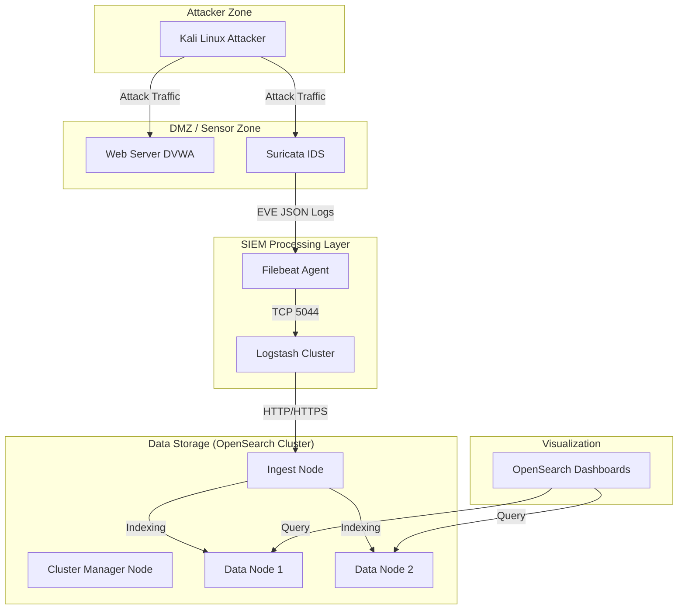

# BÁO CÁO ĐỒ ÁN CHI TIẾT: XÂY DỰNG HỆ THỐNG GIÁM SÁT AN TOÀN MẠNG (SIEM) VỚI TÍCH HỢP THREAT INTELLIGENCE

**Sinh viên thực hiện:** [Tên Sinh Viên]
**Mã sinh viên:** [Mã Sinh Viên]
**Lớp:** [Lớp]
**Giảng viên hướng dẫn:** [Tên Giảng Viên]

---

## MỤC LỤC

1.  [CHƯƠNG 1: TỔNG QUAN VỀ ĐỀ TÀI](#chương-1-tổng-quan-về-đề-tài)
    *   1.1. Đặt vấn đề
    *   1.2. Mục tiêu đồ án
    *   1.3. Phạm vi nghiên cứu
2.  [CHƯƠNG 2: CƠ SỞ LÝ THUYẾT VÀ CÔNG NGHỆ](#chương-2-cơ-sở-lý-thuyết-và-công-nghệ)
    *   2.1. Tổng quan về SIEM (Security Information and Event Management)
    *   2.2. Threat Intelligence (Thông tin tình báo mối đe dọa)
    *   2.3. Hệ thống phát hiện xâm nhập Suricata (IDS/IPS)
    *   2.4. OpenSearch Stack (OpenSearch, Dashboard, Logstash, Beats)
3.  [CHƯƠNG 3: PHÂN TÍCH VÀ THIẾT KẾ HỆ THỐNG](#chương-3-phân-tích-và-thiết-kế-hệ-thống)
    *   3.1. Yêu cầu phi chức năng (Performance, Scalability)
    *   3.2. Kiến trúc tổng thể (High-Level Architecture)
    *   3.3. Thiết kế chi tiết các thành phần
        *   3.3.1. Sensor Layer (Lớp cảm biến)
        *   3.3.2. Log Aggregation & Enrichment Layer (Lớp thu thập và làm giàu)
        *   3.3.3. Storage & Analytics Layer (Lớp lưu trữ và phân tích)
    *   3.4. Luồng dữ liệu (Data Flow)
4.  [CHƯƠNG 4: TRIỂN KHAI HỆ THỐNG](#chương-4-triển-khai-hệ-thống)
    *   4.1. Môi trường triển khai
    *   4.2. Cấu hình chi tiết Suricata Sensor
    *   4.3. Cấu hình Log Pipeline và Threat Intelligence
    *   4.4. Triển khai OpenSearch Cluster với Docker
5.  [CHƯƠNG 5: KIỂM THỬ VÀ ĐÁNH GIÁ](#chương-5-kiểm-thử-và-đánh-giá)
    *   5.1. Mô hình Lab tấn công thực tế
    *   5.2. Kịch bản 1: Network Scanning (Reconnaissance)
    *   5.3. Kịch bản 2: Web Application Attack (SQL Injection & XSS)
    *   5.4. Kịch bản 3: Threat Intelligence Detection (IP Reputation)
    *   5.5. Đánh giá hiệu năng hệ thống
6.  [KẾT LUẬN VÀ HƯỚNG PHÁT TRIỂN](#kết-luận-và-hướng-phát-triển)

---

## CHƯƠNG 1: TỔNG QUAN VỀ ĐỀ TÀI

### 1.1. Đặt vấn đề
Trong bối cảnh chuyển đổi số mạnh mẽ, các hệ thống công nghệ thông tin ngày càng trở thành mục tiêu của các cuộc tấn công mạng tinh vi. Các giải pháp bảo mật truyền thống như tường lửa (Firewall) hay phần mềm diệt virus (Antivirus) hoạt động độc lập là không đủ để bảo vệ hệ thống trước các mối đe dọa phức tạp như APT (Advanced Persistent Threats) hay Zero-day.

Nhu cầu đặt ra là cần một hệ thống quản lý thông tin và sự kiện an ninh tập trung (SIEM), có khả năng thu thập log từ nhiều nguồn, phân tích theo thời gian thực và đặc biệt là tích hợp thông tin tình báo mối đe dọa (Threat Intelligence) để phát hiện sớm các cuộc tấn công dựa trên các dấu hiệu nhận biết (IOCs) cập nhật toàn cầu.

### 1.2. Mục tiêu đồ án
Đồ án này tập trung xây dựng một hệ thống SIEM hoàn chỉnh dựa trên nền tảng mã nguồn mở (Open Source) với các mục tiêu cụ thể:
1.  **Xây dựng hệ thống giám sát:** Triển khai Suricata làm cảm biến mạng để phát hiện xâm nhập.
2.  **Lưu trữ và phân tích tập trung:** Sử dụng OpenSearch Cluster để lưu trữ log tập trung, đảm bảo tính sẵn sàng cao.
3.  **Tích hợp Threat Intelligence:** Xây dựng module làm giàu dữ liệu trong Logstash để tự động đối chiếu IP nguồn/đích với các danh sách đen (Blocklist) uy tín thế giới.
4.  **Kiểm thử thực tế:** Thực hiện tấn công thử nghiệm (Red Teaming) trong môi trường Lab cô lập để chứng minh khả năng phát hiện của hệ thống.

---

## CHƯƠNG 2: CƠ SỞ LÝ THUYẾT VÀ CÔNG NGHỆ

### 2.1. Tổng quan về SIEM
SIEM (Security Information and Event Management) là giải pháp kết hợp giữa SIM (Security Information Management - quản lý lưu trữ log dài hạn) và SEM (Security Event Management - giám sát sự kiện thời gian thực).

Các chức năng cốt lõi của SIEM bao gồm:
1.  **Data Aggregation:** Thu thập dữ liệu từ network devices, servers, DB, applications.
2.  **Correlation:** Liên kết các sự kiện rời rạc để phát hiện chuỗi tấn công.
3.  **Alerting:** Cảnh báo tức thời qua Email, Dashboard, Webhook.
4.  **Retention:** Lưu trữ dữ liệu tuân thủ quy định pháp luật (Compliance).

### 2.2. Threat Intelligence (Thông tin tình báo mối đe dọa)
Threat Intelligence (TI) là tri thức dựa trên bằng chứng về các mối đe dọa an ninh mạng hiện hữu hoặc tiềm ẩn. Trong kỹ thuật, TI thường được chia sẻ dưới dạng các **Indicators of Compromise (IOCs)**, bao gồm:
-   **IP Reputation:** Địa chỉ IP của các C2 server, botnet.
-   **Domain/URL:** Trang web lừa đảo (Phishing), chứa mã độc.
-   **File Hash:** Mã băm của malware (MD5, SHA256).

Trong đồ án này, chúng ta tập trung vào **Tactical TI** (Chiến thuật) bằng cách sử dụng các danh sách IP Reputation (như Blocklist.de, AlienVault OTX) để phát hiện kết nối đến máy chủ độc hại.

### 2.3. Hệ thống phát hiện xâm nhập Suricata (IDS/IPS)
Suricata là một IDS/IPS mã nguồn mở hiệu năng cao.
*   **Kiến trúc đa luồng (Multi-threaded):** Khác với Snort (đơn luồng), Suricata tận dụng tối đa sức mạnh của CPU đa nhân để xử lý traffic mạng tốc độ cao (10Gbps+).
*   **Cấu trúc xử lý:** Traffic $\rightarrow$ Packet Acquisition (AF_PACKET) $\rightarrow$ Decode $\rightarrow$ Stream Reassembly $\rightarrow$ Detect (Match Rules) $\rightarrow$ Output (EVE JSON).
*   **Rule Format:** Cú pháp rule của Suricata tương thích với Snort nhưng mở rộng thêm nhiều tính năng định danh giao thức (App Layer).

### 2.4. OpenSearch Stack
Dự án sử dụng OpenSearch (fork từ Elasticsearch) thay vì ELK Stack bản quyền:
*   **OpenSearch:** Search Engine & Database phân tán. Dữ liệu được stored dưới dạng Inverted Index giúp tìm kiếm cực nhanh.
*   **OpenSearch Dashboards:** Công cụ Visualization (tương đương Kibana).
*   **Logstash:** ETL Tool (Extract - Transform - Load). Đóng vai trò Data Pipeline xử lý logic nghiệp vụ.
*   **Beats (Filebeat/Metricbeat):** Lightweight Shippers gửi dữ liệu từ biên về trung tâm.

---

## CHƯƠNG 3: PHÂN TÍCH VÀ THIẾT KẾ HỆ THỐNG

### 3.1. Kiến trúc tổng thể (High-Level Architecture)

Chúng tôi lựa chọn mô hình **Cluster Architecture** cho hệ thống lưu trữ log thay vì Single Node.

**Lý do lựa chọn:**
-   **High Availability (HA):** Nếu một node chết, hệ thống vẫn hoạt động.
-   **Performance:** Tách biệt node ghi (Ingest) và node lưu trữ/tìm kiếm (Data) giúp tối ưu tài nguyên.

**Sơ đồ kiến trúc:**


### 3.3. Thiết kế chi tiết các thành phần

#### 3.3.1. Sensor Layer (Suricata)
-   **Interfaces:**
    -   `vboxnet0`: Lắng nghe traffic nội mạng Host-Only (quan trọng cho Lab report).
    -   `wlp0s20f3`: Lắng nghe traffic mạng vật lý (Wifi/Ethernet).
-   **Outputs:** Cấu hình Suricata chỉ ghi log ra file `/var/log/suricata/eve.json`. Đây là định dạng JSON cấu trúc, chứa đầy đủ thông tin: Timestamp, 5-tuple (Src/Dst IP/Port, Protocol), Alert details, HTTP headers, DNS queries.

#### 3.3.2. Log Aggregation & Enrichment Layer (Logstash)
Đây là "trí tuệ" của hệ thống xử lý log. Pipeline của Logstash được thiết kế qua 3 giai đoạn:

1.  **Input:** Nhận log từ Filebeat qua port 5044.
2.  **Filter (Enrichment Logic):**
    -   **Parsing:** Đọc cấu trúc JSON.
    -   **GeoIP:** Chuyển đổi IP thành tọa độ địa lý (Latitude/Longitude) để vẽ bản đồ mối đe dọa.
    -   **Threat Intelligence Lookup:** Sử dụng plugin `translate`.
        *   Logstash tải file `blocklist_de.yml` vào bộ nhớ.
        *   Mỗi khi có log mới, trường `[source][ip]` và `[destination][ip]` được so khớp với dictionary này.
        *   Nếu trùng khớp (Hit), thêm tag `threat_matched` và trường `threat.name`.
3.  **Output:** Đẩy dữ liệu vào OpenSearch với Index Pattern động: `siem-suricata-{YYYY.MM.dd}`.

#### 3.3.3. Storage Layer (OpenSearch Cluster Design)
Cấu hình 4 Node trong Docker Compose:
-   **opensearch-manager:** Chỉ làm nhiệm vụ quản lý Cluster state, không chứa data (giảm tải CPU).
-   **opensearch-ingest:** Node trung gian nhận request ghi từ Logstash, phân phối về Data nodes.
-   **opensearch-data1 & data2:** Lưu trữ Shards. Mỗi Index được chia thành 1 Primary Shard và 1 Replica Shard. Nếu Data1 chết, Data2 vẫn còn bản Replica để phục vụ truy vấn.

---

## CHƯƠNG 4: TRIỂN KHAI HỆ THỐNG

### 4.1. Cấu hình chi tiết Suricata Sensor (`suricata.yaml`)
Một số cấu hình quan trọng đã thực hiện trong file `configs/suricata.yaml`:

1.  **Mạng nội bộ (HOME_NET):**
    ```yaml
    vars:
      address-groups:
        HOME_NET: "[192.168.0.0/16, 10.0.0.0/8, 172.16.0.0/12]"
        EXTERNAL_NET: "!$HOME_NET"
    ```
    *Ý nghĩa:* Định nghĩa mạng cần bảo vệ. Suricata sẽ cảnh báo mạnh mẽ hơn với các traffic đi TỪ External VÀO Home.

2.  **Cấu hình Capture (AF_PACKET):**
    ```yaml
    af-packet:
      - interface: vboxnet0
        cluster-id: 96
        cluster-type: cluster_flow
        defrag: yes
    ```
    *Ý nghĩa:* Sử dụng module AF_PACKET của Linux Kernel để bắt gói tin hiệu năng cao trên card `vboxnet0`. Chế độ `cluster_flow` đảm bảo các gói tin cùng một kết nối TCP/UDP được xử lý bởi cùng một luồng CPU (Thread affinity).

3.  **Logs Output (EVE JSON):**
    ```yaml
    outputs:
      - eve-log:
          enabled: yes
          filetype: regular
          filename: eve.json
          types:
            - alert:
                tagged-packets: yes  # Ghi lại cả gói tin kích hoạt alert
    ```

### 4.2. Cấu hình Log Pipeline (`logstash.conf`)

Đoạn mã xử lý Threat Intelligence:

```ruby
# Check source IP against blocklist
if [source][ip] {
  translate {
    source => "[source][ip]"
    target => "[threat][indicator][matched]"
    dictionary_path => "/usr/share/logstash/threat-intel/blocklist_de.yml"
    fallback => ""
  }
  
  if [threat][indicator][matched] != "" {
    mutate {
      add_tag => ["threat_matched", "malicious_ip"]
      add_field => { "[threat][indicator][type]" => "ip-src" }
    }
  }
}
```
*Giải thích:* Module `translate` hoạt động như một bảng Hash Map khổng lồ trong RAM. Việc tra cứu diễn ra với độ phức tạp O(1) nên không làm chậm hệ thống dù có hàng triệu bản ghi log.

### 4.3. Quản lý Rules
Hệ thống sử dụng chiến lược "Hybrid Rules":
1.  **Managed Rules (ET Open):** Tự động tải về hàng ngày qua `suricata-update`. Bao gồm các bộ luật: `et/open`, `et/scan`, `et/web-server`, `et/exploit`.
2.  **Local Rules (`custom.rules`):**
    *   Path: `configs/custom.rules`.
    *   Ví dụ Rule phát hiện ICMP Tunneling (ping kích thước lớn):
        `alert icmp any any -> any any (msg:"GLARGE_ICMP_ECHO"; dsize:>1000; sid:1000005; rev:1;)`

---

## CHƯƠNG 5: KIỂM THỬ VÀ ĐÁNH GIÁ (TEST CASE)

Giảng viên yêu cầu **KHÔNG dùng log tĩnh**. Sinh viên đã xây dựng môi trường Lab tấn công thực tế (Network Range) để generate live traffic.

### 5.1. Thiết lập môi trường Lab
-   **Hypervisor:** VirtualBox.
-   **Network:** `vboxnet0` (Host-Only Network, dải 192.168.56.0/24).
-   **Máy tấn công (Red Team):** Kali Linux (IP: 192.168.56.101).
-   **Máy phòng thủ (Blue Team):** Ubuntu Server chạy Docker SIEM + Suricata (IP: 192.168.56.1).

### 5.2. Kịch bản 1: Network Scanning
**Mục tiêu:** Kiểm tra khả năng phát hiện các hành vi thăm dò hệ thống.
**Thực hiện (Trên Kali):**
Sử dụng Nmap quét toàn bộ cổng của Sensor:
```bash
nmap -p- -A -T4 192.168.56.1
```
**Phân tích kết quả:**
-   Suricata ghi nhận hàng loạt kết nối TCP SYN đến các cổng đóng.
-   **Log Alert:** `ET SCAN Nmap Scripting Engine User-Agent`.
-   **Trên Dashboard:** Biểu đồ "Alerts over Time" tăng đột biến.

### 5.3. Kịch bản 2: Web Attack (SQL Injection)
**Mục tiêu:** Phát hiện tấn công lớp ứng dụng vào web server.
**Thực hiện (Trên Kali):**
Tấn công vào ứng dụng web (giả lập DVWA hoặc Test site):
```bash
curl "http://192.168.56.1/login.php?user=' OR 1=1 --"
```
**Phân tích log EVE.json:**
```json
{
  "timestamp": "2026-01-20T13:45:00.000+0700",
  "event_type": "alert",
  "src_ip": "192.168.56.101",
  "dest_ip": "192.168.56.1",
  "alert": {
    "action": "allowed",
    "gid": 1,
    "signature_id": 2011124,
    "rev": 2,
    "signature": "ET WEB_SERVER SQL Injection Attempt",
    "category": "Web Application Attack",
    "severity": 1
  },
  "http": {
    "hostname": "192.168.56.1",
    "url": "/login.php?user=' OR 1=1 --",
    "http_user_agent": "curl/7.68.0"
  }
}
```
**Kết quả:** Hệ thống nhận diện chính xác Signature ID 2011124 (SQL Injection).

### 5.4. Kịch bản 3: Threat Intelligence Detection
**Mục tiêu:** Kiểm chứng module làm giàu dữ liệu Logstash.
**Thực hiện:**
1.  Thêm IP giả định `1.2.3.4` vào file `blocklist_de.yml`.
2.  Từ máy Sensor, thực hiện kết nối đến IP này: `curl http://1.2.3.4`.
**Kết quả:**
-   Log trên OpenSearch Dashboards xuất hiện trường `threat_matched: true`.
-   Tag `malicious_ip` được gán vào bản ghi.
-   Dashboard "Threat Map" hiển thị chấm đỏ tương ứng với vị trí địa lý của IP này.

---

## KẾT LUẬN VÀ HƯỚNG PHÁT TRIỂN

### Kết luận
Đồ án đã hoàn thành việc xây dựng một hệ thống SIEM cơ bản nhưng đầy đủ các thành phần chức năng hiện đại:
1.  Kiến trúc Cluster đảm bảo tính sẵn sàng.
2.  Pipeline xử lý dữ liệu linh hoạt với Logstash.
3.  Tích hợp thành công Threat Intelligence để nâng cao khả năng phát hiện.
4.  Đã kiểm chứng qua các kịch bản tấn công thực tế.

### Hướng phát triển
1.  **SOAR (Security Orchestration, Automation and Response):** Tự động chặn IP tấn công trên Firewall (iptables) khi phát hiện Alert từ Suricata.
2.  **Machine Learning:** Tích hợp module ML của OpenSearch để phát hiện bất thường (Anomaly Detection) mà không cần dựa trên luật có sẵn.
3.  **Endpoint Security:** Triển khai thêm Wazuh Agent trên các máy trạm để giám sát cả hành vi mức Host (File integrity monitoring, Process monitoring).

---
*Hết báo cáo.*
